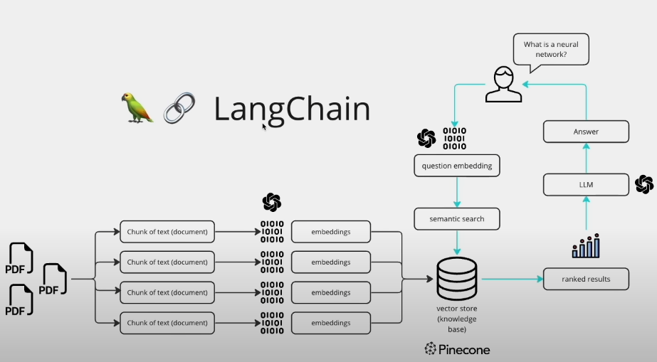

You're right — let’s finalize this `README.md` so it’s clean, properly structured, and includes your summary of steps at the end.

Here’s the complete and corrected `README.md` for your **Medical Report Chatbot** — with the correct markdown formatting, image reference, setup steps, and your processing flow at the bottom:

---

````markdown
# ⚕️ Medical Report Chatbot using LLMs, Streamlit, and FAISS

This project is a Streamlit-based Medical Assistant that allows users to upload PDF medical reports and interact with them using Large Language Models (LLMs). The app performs summarization, extracts health metrics, predicts disease risks, detects similar reports, and visualizes health trends — all in one place.

---

## 🚀 Features

- 📄 **PDF Report Parsing**: Extracts text from medical reports.
- 🧠 **LLM-based Summarization**: Utilizes Mixtral-8x7B-Instruct via Together API for concise summaries.
- 📊 **Health Metric Extraction**: Parses and presents health metrics in a tabular summary.
- 🧬 **Disease Risk Prediction**: Predicts potential disease risks based on extracted metrics.
- 🔍 **Similar Report Matching**: Employs FAISS and embeddings to find similar medical reports.
- 📈 **Trend Analysis**: Provides insights into health trends when multiple reports are uploaded.
- 🗨️ **Chat with Reports**: Offers conversational retrieval using LangChain for interactive Q&A.
- 📥 **Downloadable Summaries**: Allows downloading summaries in TXT and PDF formats.
- 📈 **Interactive Visuals**: Includes bar charts, radial health scores, and reference tables for better understanding.

---

## 🧩 Tech Stack

| Component             | Technology                                   |
|----------------------|-----------------------------------------------|
| Frontend UI           | Streamlit                                    |
| PDF Parsing           | PyPDF2                                       |
| LLM Integration       | LangChain + Together API                     |
| Chat Memory           | ConversationBufferMemory                     |
| Vector DB             | FAISS                                        |
| Embeddings            | HuggingFace Transformers (all-mpnet-base-v2) |
| Visualization         | Matplotlib / Plotly (via Streamlit)          |
| PDF Export            | ReportLab / FPDF (custom function)           |
| File I/O              | Pandas, Streamlit file uploader              |
| Environment Variables | python-dotenv                                |

---



---

## 🧠 How It Works

1. **Upload PDF(s)**: Users upload medical reports via the Streamlit sidebar.
2. **Extract Text**: PyPDF2 extracts textual content from the PDFs.
3. **Summarize Report**: LangChain + Together API (Mixtral model) summarizes the report.
4. **Parse Metrics**: Health metrics are extracted from LLM output in JSON format.
5. **Visualize Metrics**: Metrics are visualized and flagged if out of range.
6. **Predict Disease Risks**: Risk predictions (e.g., anemia) using custom logic.
7. **Find Similar Reports**: FAISS and sentence embeddings detect similar reports.
8. **Chat Interactively**: Ask questions about the report using Conversational Retrieval Chain.

---

## 💬 Conversational Retrieval Setup

- **Text Splitting**: Uses `CharacterTextSplitter` to chunk report text.
- **Embedding Generation**: Uses HuggingFace's `all-mpnet-base-v2`.
- **Vector Storage**: Chunks are indexed using FAISS for fast retrieval.
- **Contextual Chat**: Combines memory + retriever + LLM for multi-turn Q&A.

---

## 🔐 Environment Variables

Create a `.env` file in your project root:

```ini
TOGETHER_API_KEY=your_together_api_key_here
````

---

## 🛠️ Setup Instructions

1. **Clone the repository**:

```bash
git clone https://github.com/your-username/medical-chatbot.git
cd medical-chatbot
```

2. **Create and activate a virtual environment**:

```bash
python -m venv venv
source venv/bin/activate  # For Windows: .\venv\Scripts\activate
```

3. **Install dependencies**:

```bash
pip install -r requirements.txt
```

4. **Add your `.env` file** with Together API key:

```ini
TOGETHER_API_KEY=your_together_api_key_here
```

5. **Run the Streamlit app**:

```bash
streamlit run app.py
```

---

## 🔄 Internal Flow Summary

1. Extract text from uploaded PDFs.
2. Split the extracted text into overlapping chunks.
3. Generate embeddings using a HuggingFace model.
4. Index embeddings into FAISS vector store.
5. Create a Conversational Retrieval Chain (LLM + Retriever + Memory).
6. Maintain persistent conversation state to handle follow-up questions.
7. Additionally:

   * Summarize medical reports using LLMs.
   * Parse and display health metrics in tabular and visual formats.
   * Predict disease risks using predefined logic.
   * Identify similar reports from existing indexed ones.
   * Generate downloadable summaries and full reports.

